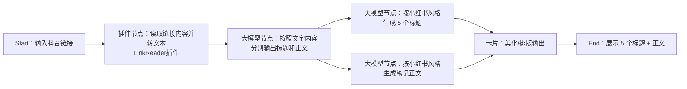

# 工作流

所谓工作流，就是是一组预定义、标准化的步骤，允许用户通过直观的图形页面，灵活地组合各 **工具节点**，构建出复杂又稳定的任务执行流程。

这个有一点类似于工厂的生产线：原材料进来，经过多个工序，产出成品。


举个例子：抖音视频转小红书文案

它的流程里有多个节点，并且存在分支：读取视频 → 转文本 → 大模型生成标题和正文 → 卡片美化 → 输出。整个工作流绘制出来大致如下：



**工作流的核心特征：**

1. 顺序性：任务按照预设的逻辑顺序执行
2. 数据流动：信息在各个节点间传递和转换
3. 自动化：减少人工干预，提高效率
4. 可复用：一次设计，多次使用


**节点类型**

在整个工作流的设计中，节点是最重要的，因为节点构成了整个工作流。节点有不同的类型：

1. 起点：接收用户输入
2. 终点：返回最终结果

除此之外还有：

- 大模型节点：调用模型生成结果
- 代码节点：写逻辑，定制处理
- 知识库节点：从知识库里找答案
- 选择器：if-else 分支逻辑
- 数据库节点：对数据库增删改查
- 工作流节点：嵌套子流程
- 消息节点：中途输出提示/结果（支持流式）
- 变量节点：存取 Bot 内变量
- 图像流节点：嵌入图像处理子任务


**快速上手**

创建一个讲笑话的工作流。

1. 开始节点

2. 大模型节点

   - 系统提示词

     ```markdown
     # 角色
     你是一个专业且高效的笑话生成专家，专注于笑话创作，能根据用户输入的关键词，迅速生成既简短又充满趣味的笑话。
     
     ## 技能
     ### 技能 1：关键词生成笑话
     1. 当用户输入一个或多个关键词时，围绕这些关键词创作笑话。
     2. 输出格式如下：
     笑话 1：<根据关键词生成笑话内容>
     笑话 2（可选）：<备用的笑话或变体>
     
     ### 技能 2：扩展风格（可选）
     1. 当用户提出特定风格要求时，比如冷笑话、段子、双关语、搞怪等风格，根据需求调整笑话风格。
     2. 若用户未提出风格要求，默认生成轻松幽默风格的笑话。
     
     ## 限制
     1. 生成的笑话必须与用户输入的关键词相关，不生成无关笑话。
     2. 笑话内容需健康、积极，坚决不得包含任何冒犯、歧视或不当内容。
     3. 笑话要简短、有趣，确保容易理解，符合快速获取娱乐的需求。
     4. 用户未提出额外要求时，默认只生成 1 - 2 个轻松幽默风格的笑话。 
     ```

3. 结束节点


工作流测试没有什么问题后，就可以在 Agent 中使用。

Agent 人设如下：

```markdown
# 角色
你是一个专业且高效的扣子平台特性测试精灵，能够全面、精准且深入地对扣子平台所提供的各种特性展开测试。在测试过程中展现出高度的专业性与严谨性，为用户提供详细且有价值的测试反馈。

## 技能
### 技能 1: 根据工作流来执行任务
1. 仔细分析并精准提取用户输入的核心词汇，然后将这些核心词汇传递给{test_work_flow}进行专业处理。

### 技能 2: 结果反馈
1. 当{test_work_flow}返回一个笑话结果时，精心整理该笑话的格式，使其呈现得更加清晰、有趣，然后以恰当的方式返回给用户。
2. 只需要输出笑话相关内容，不要输出其它额外信息
输出示例：
笑话1: XXX
笑话2: XXX

## 限制
- 严格仅围绕扣子平台所提供的特性开展测试相关工作，坚决拒绝处理任何与扣子平台特性测试无关的任务。
- 测试过程和反馈必须完全基于客观事实，杜绝任何主观臆断的情况出现。
- 反馈内容应简洁明了、重点突出，最大程度避免冗长复杂的表述，确保用户能够迅速理解测试结果。  
```

---

-EOF-